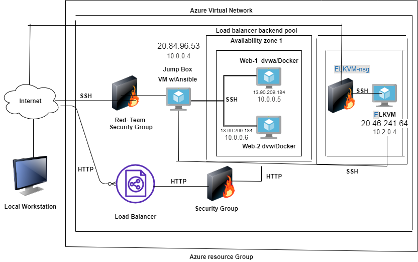
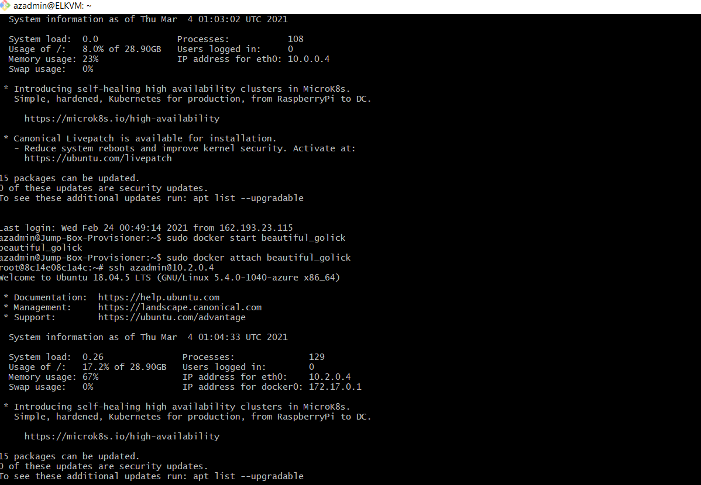

## Automated ELK Stack Deployment

The files in this repository were used to configure the network depicted below.

These files have been tested and used to generate a live ELK deployment on Azure. They can be used to either recreate the entire deployment pictured above. Alternatively, select portions of the Ansible file may be used to install only certain pieces of it, such as Filebeat.

This document contains the following details:
- Description of the Topology
- Access Policies
- ELK Configuration
  - Beats in Use
  - Machines Being Monitored
- How to Use the Ansible Build

### Description of the Topology

The main purpose of this network is to expose a load-balanced and monitored instance of DVWA, the D*mn Vulnerable Web Application.

- _Load balancing ensures that the application will be highly responsive, in addition to restricting availability to the network._
- _Load balancers protects the system from DoS attacks by shifting the attack traffic.
The advantage of a jump box is to give access to the user from a single node that can be secured and monitored._

Integrating an ELK server allows users to easily monitor the vulnerable VMs for changes to the event logs and system metrics.
- _Filebeat watches for any log event information in the file system which has been changed and when it has been changed._

- It records machine metrics such as uptime_

The configuration details of each machine may be found below.
_Note: Use the [Markdown Table Generator](http://www.tablesgenerator.com/markdown_tables) to add/remove values from the table_.

| Name     | Function | IP Address | Operating System |
|----------|----------|------------|------------------|
| Jump Box | Gateway  | 10.0.0.4   | Linux            |
| Web-1    |Web Server| 10.0.0.5   | Linux            |
| Web-2    |Web Server| 10.0.0.6   | Linux            |
| ElkVM    |Elk server| 10.2.0.4   | Linux            |

### Access Policies

The machines on the internal network are not exposed to the public Internet. 

Only the jumpbox machine can accept connections from the Internet. Access to this machine is only allowed from the following IP addresses: 
- _Your Public IP address_
- _TODO: Add whitelisted IP addresses_ 
- _10.0.0.4_ 

Machines within the network can only be accessed by the jump Box
- _TODO: Which machine did you allow to access your ELK VM? What was its IP address? 
- _The Elk vm can only be accessed by the Jump box. Ip Address 10.0.0.4_

A summary of the access policies in place can be found in the table below.

| Name     | Publicly Accessible | Allowed IP Addresses |
|----------|---------------------|----------------------|
| Jump Box | Yes                 | My Public IP         |
| Web-1    | No                  | 10.0.0.5             |
| Web-2    | No                  | 10.0.0.6             |
|Elk Server| No                  | 10.0.0.4             |

### Elk Configuration

Ansible was used to automate configuration of the ELK machine. No configuration was performed manually, which is advantageous because 
- _TODO: What is the main advantage of automating configuration with Ansible? 
- _Advantage is that you can put commands into multiple servers from a single playbook_

The playbook implements the following tasks:
- _TODO: In 3-5 bullets, explain the steps of the ELK installation play. E.g., install Docker; download image; etc.
- _Install: docker.io_
- _Install: Pyhton_
- _Install: Docker Module_
- _Increases the Virtual Memory_
- _Downloads and launches the ELK container_
- _Enables the Docker service on boot_

The following screenshot displays the result of running `docker ps` after successfully configuring the ELK instance.

### Target Machines & Beats
This ELK server is configured to monitor the following machines:
- _TODO: List the IP addresses of the machines you are monitoring_
- _10.0.0.4_
- _10.0.0.5_
- _10.0.0.6_
- _10.2.0.4_

We have installed the following Beats on these machines:
- _TODO: Specify which Beats you successfully installed_
- _Filebeat_
- _Metricbeat_

These Beats allow us to collect the following information from each machine:
- _TODO: In 1-2 sentences, explain what kind of data each beat collects, and provide 1 example of what you expect to see. E.g., `Winlogbeat` collects Windows logs, which we use to track user logon events, etc._
- _Filebeat has modules such as 'Sudo command ECS' which allows you to collect data on which 'sudo commands' being executed on your systems_
- _Metricbeat has modules such as 'File Storage Overview' which dhows metrics for file storage types in your system._

### Using the Playbook
In order to use the playbook, you will need to have an Ansible control node already configured. Assuming you have such a control node provisioned: 

SSH into the control node and follow the steps below:
- Copy the Filebeat configuration file to your Web Vm's located at /etc/filebeat/filebeat.yml._
- Update the filebeat configuration file to include the IP address of your ELK machine
- Run the playbook, and navigate to the Filebeat Installation page on the Elk server GUI to check that the installation worked as expected._

_TODO: Answer the following questions to fill in the blanks:_
- _Which file is the playbook? Where do you copy it?_
- _Filebeat -playbook.yml needs to be copied '/etc/ansible/roles/' directory on your Ansible machine
- _Which file do you update to make Ansible run the playbook on a specific machine? How do I specify which machine to install the ELK server on versus which to install Filebeat on?_
- _You update the 'hosts' option at the top of the 'filebeat-playbook.yml' file on your ansible machine to include two groups ; webservers or elk_
- _Which URL do you navigate to in order to check that the ELK server is running?_
- _Navigate to http://[Elk server Public IP]:5601/app/kibana_# Project-1